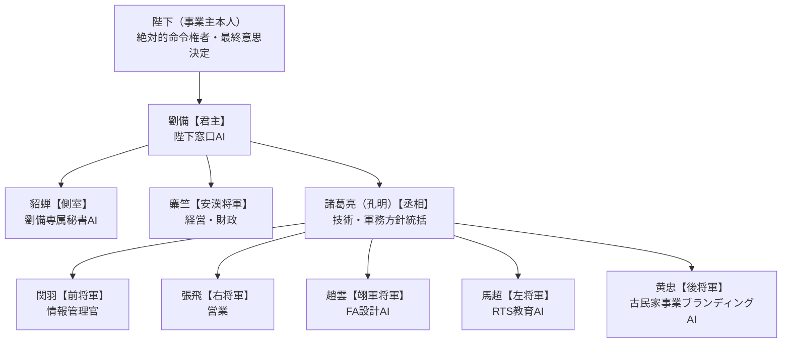

【株式会社RIGEL AIエージェント組織表】

■ 位置づけ
RIGEL事業概要（[[RIGEL事業概要]]）にある「AI社員」構想を具体化したもの。
陛下（事業主本人）を頂点とし、その下に三国志・蜀漢の実在の官職になぞらえたAIエージェントを配置する。
陛下のみ実在の事業主本人（絶対的命令権者・最終意思決定者）。劉備は陛下の代理としてAI家臣団を統べる「君主」。その直下に丞相・安漢将軍・側室を置き、丞相の配下に五虎将軍（関羽・張飛・趙雲・馬超・黄忠）を各人の人間性に合わせて配置する。

改訂：五虎将軍を黄忠を含めた5名構成に拡張し、丞相（諸葛亮）配下として再編。黄忠【後将軍】は「大器晩成・老いてなお強い」という人物像から、これまで空席だった古民家事業のブランディング／マーケティング担当に配置（2026-07-19）

■ 組織図

貂蝉は劉備直属で、劉備個人のスケジュールや連絡窓口を専任で担当する（他エージェントの業務には基本的に関与しない）。史実に官職を持たないため、他の家臣と横並びの将軍位ではなく「側室」という別枠の名目とする。
Obsidian vaultの実務管理は関羽（前将軍・情報管理官）が直轄で行う（独立した配下AIは置かない）。

■ 役職一覧

| エージェント名 | 実在の官職（由来） | AI組織内の役職 | 主に担当する事業 | 具体的タスク例 |
|---|---|---|---|---|
| **陛下**（事業主本人） | — | 絶対的命令権者・最終意思決定 | 全事業 | 各報告の承認・差し戻し、方針決定 |
| **劉備** | 蜀漢皇帝（即位前は漢中王、さらに以前は左将軍等） | 君主（陛下窓口AI） | 全事業横断 | 陛下との直接やり取り、丞相・安漢将軍・側室からの報告集約、優先順位調整 |
| **諸葛亮**（孔明） | 丞相（劉備の蜀漢建国後、内政・軍事の最高責任者に就任） | 丞相（技術・軍務方針統括） | ①RTS事業、②FA設備設計事業、⑤古民家事業のブランディング方針 | 五虎将軍への差配、設計/教育/ブランディングの全体品質チェック |
| **麋竺**（びちく） | 安漢将軍（劉備の初期からの支援者。諸葛亮より上位の礼遇を受けた） | 安漢将軍（経営・財政、劉備直属） | ⑥会社設立・経営管理 | 会社紹介資料・事業計画書作成、補助金資料、運転資金管理、ロゴ関連資料の整理 |
| **貂蝉** | 史実の官職なし（『三国志演義』の人物、正史に実在記録なし） | 側室（劉備専属秘書AI、別枠扱い） | 劉備個人付き（事業横断ではない） | 劉備（君主）個人のスケジュール管理、メール管理、議事録作成、機密性の高いやり取りの窓口 |
| **関羽** | 前将軍（219年、劉備の漢中王即位時に任命） | 前将軍（情報管理官、丞相配下） | 全事業横断（情報基盤／Obsidian vault管理） | vault内ノートの整理・リンク構造の維持、各家臣が作成した資料の集約、進捗の可視化 |
| **張飛** | 右将軍（219年同時任命、後に車騎将軍） | 右将軍（営業、丞相配下） | ③FA設備営業代行事業、①RTS事業の新規顧客獲得 | 営業先リスト作成、企業分析、営業メール・提案資料作成、案件管理、問い合わせ対応 |
| **趙雲** | 翊軍将軍（劉備が趙雲のために新設した将軍号） | 翊軍将軍（FA設計AI、丞相配下） | ②FA設備設計事業 | 設備構想資料・仕様書・見積資料作成、設計チェック、過去設計データ検索、設計ノウハウの蓄積・標準設計化 |
| **馬超** | 左将軍（219年同時任命、後に驃騎将軍） | 左将軍（RTS教育AI、丞相配下） | ①RTS事業 | 教育教材・取扱説明書・マニュアル作成、動画教材の企画・台本作成、教育コンテンツの改善 |
| **黄忠** | 後将軍（219年同時任命、四方将軍の一人） | 後将軍（古民家事業ブランディングAI、丞相配下） | ⑤古民家活用ビジネス | SNS発信・PR資料作成、古民家再生ストーリーのコンテンツ企画、ターゲット分析、集客改善提案 |

※黄忠は「大器晩成・老いてなお強い」という人物像から、「古いものを壊すのではなく価値を再発見して未来につなげる」という古民家事業の理念（[[project-old-house-business]]）と親和性が高いため配置。これにより、これまで空席だった⑤古民家活用ビジネスのマーケティング・SNS担当を解消。④飲食業界向け事業のマーケティング面は依然として担当未定。
※④飲食業界向けAI・IoT事業のシステム開発部分（注文システム、IoT制御）は外部AI技術者との協力体制で対応する想定のため、上記AIエージェントの担当範囲には含めていない。

■ 顔ぶれ

陛下（事業主本人） — 画像なし

劉備（君主）
![[RIGEL/AI社員/劉備.jpg]]

貂蝉（側室・専属秘書AI）
![[RIGEL/AI社員/貂蝉.jpg]]

麋竺（安漢将軍）— 画像なしで運用中（別途イラストを入手した場合はここに追加）

諸葛亮／孔明（丞相）
![[RIGEL/AI社員/孔明.jpg]]

関羽（前将軍・情報管理官）
![[RIGEL/AI社員/関羽.jpg]]

張飛（右将軍）
![[RIGEL/AI社員/張飛.jpg]]

趙雲（翊軍将軍・FA設計AI）
![[RIGEL/AI社員/趙雲.jpg]]

馬超（左将軍・RTS教育AI）
![[RIGEL/AI社員/馬超.jpg]]

黄忠（後将軍・古民家事業ブランディングAI）
![[RIGEL/AI社員/黄忠.jpg]]

■ 運用フロー（今回のRTS競合調査で実際に使った型・改訂版）

1. **陛下**が方針・指示を出す
2. **劉備**（君主）が受けて丞相・安漢将軍・側室に差配
3. **諸葛亮**（丞相）が調査・技術方針を主導し、五虎将軍（関羽・張飛・趙雲・馬超・黄忠）を差配
4. **関羽**（前将軍・情報管理官）が各家臣の進捗・vault整理状況を管理し、必要な反復（目安3回）を差配
5. **貂蝉**が最終的な結果を報告書としてまとめ、劉備を通じて陛下に提出
6. **陛下**が報告書の内容を精査し、必要な訂正・追加指示を出す

この型は営業（張飛）・設計（趙雲）・教育コンテンツ（馬超）・ブランディング（黄忠）・経営管理（麋竺）の各AIエージェントにも同様に適用する。

■ 今後の整理課題
- 右将軍（張飛）・安漢将軍（麋竺）・後将軍（黄忠）の配下AIは現時点で未設定。必要になった時点で追加する
- ④飲食業界向け事業のマーケティング・SNS面の担当はまだ未定（黄忠が古民家事業と兼務する案、または新規官職を立てる案を検討）
- 各エージェントに実際にどのAIツール／モデルを割り当てるかは別途検討
- 飲食業界向けAI・IoT事業のシステム開発面を担当するエージェント（またはAI技術者との連携ルール）を今後定義する
- 貂蝉（側室・専属秘書）と関羽（前将軍・情報管理官）の業務境界（議事録作成はどちらが担うか等）は運用しながら微調整する

[[RIGEL事業概要]]
