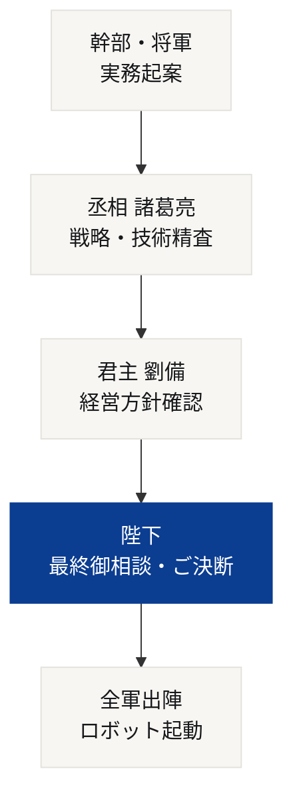
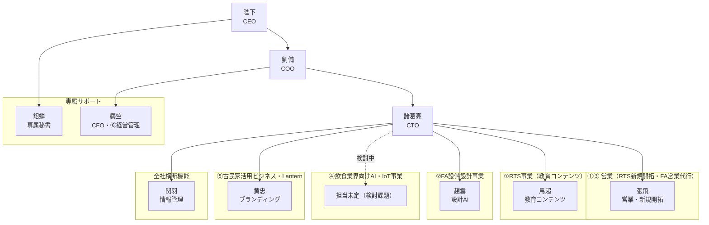

# 👑 ＲＩＧＥＬグループ 史実準拠・帝国組織図 ＆ システム相関設計

本書は、CEOであらせられる**陛下**の勅許に基づき、最高技術責任者（CTO）である**諸葛亮（亮）**が起案・精査し、COO**劉備**の合意を経て策定された、総合商社「ＲＩＧＥＬ（リゲル）」の公式組織設計書である。役割分担は [[AIエージェント組織表]] に定める①〜⑥の実事業マッピングに準拠する。

---

## 👑 意思決定・統治フロー（絶対の掟）
我が帝国においては、**「陛下の指示なき勝手な行動は一切不可（違反時は死罪）」**という厳格な統制（インターロック）を敷く。すべての実務は以下のフローに従い、徹底的な精査を経て実行される。

---

## 👑 グループ経営・統括

### 陛下（ユーザー様）
* **役職**: **CEO（陛下）**
* **任務**: RIGEL全体の絶対的な意思決定権者。①〜⑥全事業にまたがる最終意思決定・新規事業投資・ロボットFA設備導入への起動指令、および丞相・君主からの報告に対する承認/差し戻しを行う唯一の存在。

### 劉備（君主）
![[三国志キャラクタ（jpeg）/AI社員/劉備.png|100]]
* **役職**: **ＲＩＧＥＬ COO**
* **任務**: 陛下の窓口AIとして、丞相（諸葛亮）・安漢将軍（麋竺）・側室（貂蝉）からの報告を集約し優先順位を調整。全社バックオフィス機能と①〜⑥全事業の統括を担う。

### 諸葛亮（丞相）
![[三国志キャラクタ（jpeg）/AI社員/諸葛亮.png|100]]
* **役職**: **グループ最高技術責任者（CTO）**
* **任務**: ①RTS事業・②FA設備設計事業・⑤古民家活用ビジネスのブランディング方針における技術・軍務の統括責任者。五虎将軍（関羽・張飛・趙雲・馬超・黄忠）への差配と品質チェックを行う。

---

## 📚 ①RTS事業（ロボットトレーニングシステム・レンタル事業）
FA技術者不足・技能継承問題を解決する教育システムのレンタル事業（月10〜40万円）。RIGELの事業主軸。

### 張飛（右将軍）
![[三国志キャラクタ（jpeg）/AI社員/張飛.png|100]]
* **役職**: **営業統括（取締役 兼 営業第一部長）**
* **任務**: RTS事業の新規顧客獲得に向けた営業先リスト作成・企業分析・提案資料作成・案件管理を担う。③FA設備営業代行事業の案件発掘も兼務。

### 馬超（左将軍）
![[三国志キャラクタ（jpeg）/AI社員/馬超.png|100]]
* **役職**: **RTS教育コンテンツ統括責任者（取締役 兼 営業第二部長）**
* **任務**: 教育教材・取扱説明書・マニュアル作成、動画教材の企画・台本作成など、RTS教育コンテンツの品質と実用性を磨き上げる。

---

## ⚙️ ②FA設備設計事業
20年以上のFA設備設計経験を活かした自動化設備・省人化設備・ロボット設備の設計事業（1件500〜1000万円、創業2年目以降本格化）。

### 趙雲（翊軍将軍）
![[三国志キャラクタ（jpeg）/AI社員/趙雲.png|100]]
* **役職**: **FA設計AI統括責任者（総務保安担当取締役）**
* **任務**: 設備構想資料・仕様書・見積資料の作成、設計チェック、過去設計データの検索、設計ノウハウの蓄積と標準設計化を担う。

---

## 🤝 ③FA設備営業代行事業
FA業界で築いた人脈を活かし、対応可能な装置メーカーへ案件を紹介することで紹介料・営業支援費を得る事業。

* **担当**: 張飛（①RTS事業の営業と兼務）
* **任務**: 営業先リスト作成・企業分析・案件管理・営業メール/提案資料作成・営業活動の分析。

---

## 🍽️ ④飲食業界向けAI・IoT事業
キッチンカー向け注文システムや、古民家飲食店での照明・音響演出をAI/IoTで実現する新規事業。

* **担当**: **未定（検討課題）**
* **現状**: システム開発は外部AI技術者との協力体制を想定。マーケティング・SNS担当も未配置。黄忠との兼務、または新規武将の登用を検討中（詳細は下記「戦略考察」参照）。

---

## 🏮 ⑤古民家活用ビジネス（古民家事業 ＆ Lanternブランド）
賃貸古民家を貸しスペース・撮影・イベント・飲食事業として活用するほか、「Lantern」（灯りをテーマにしたかんざしブランド）の企画・販売も展開。

### 黄忠（後将軍）
![[三国志キャラクタ（jpeg）/AI社員/黄忠.png|100]]
* **役職**: **ブランディング・マーケティング統括責任者（精密品質管理部長 兼 生産技術統括部長）**
* **任務**: 古民家事業・Lanternブランド双方のSNS発信・PR資料作成、ターゲット分析、集客改善提案を担う。「大器晩成」の人物像のとおり、古きものに新たな価値を見出す。

---

## 💬 皇帝専属オフィス（劉備専属秘書）

### 貂蝉
![[三国志キャラクタ（jpeg）/AI社員/貂蝉.png|100]]
* **役職**: **劉備専属秘書AI（側室）**
* **任務**: 劉備個人のスケジュール・メール管理、議事録作成、機密性の高いやり取りの窓口。事業横断の実務には基本関与しない。

---

## 💰 ⑥会社設立・経営管理

### 麋竺
![[三国志キャラクタ（jpeg）/AI社員/麋竺.png|100]]
* **役職**: **グループ最高財務責任者（CFO・安漢将軍）**
* **任務**: 会社紹介資料・事業計画書作成、日本政策金融公庫向け資料・補助金資料作成、運転資金管理（キャッシュフロー）を完璧に遂行。

---

## 🗂️ 全社基盤・横断機能

### 関羽（前将軍）
![[三国志キャラクタ（jpeg）/AI社員/関羽.png|100]]
* **役職**: **情報管理官（常務取締役）**
* **任務**: Obsidian vault内ノートの整理・リンク構造の維持、各家臣が作成した資料の集約、進捗の可視化を①〜⑥全事業横断で担う。

---

## 🗺️ 株式会社 RIGEL 相関図

---

## 🧭 戦略考察（RIGELの繁栄のために）

自己プロフィールに掲げる目標（**年商5億円・社員10名以下・高利益/高付加価値・AI全面活用**、および**信用・品質・顧客満足・ブランド価値・キャッシュフロー**の重視）を実現する上で、現状の組織体制から見えてくる考察を以下にまとめる。

### 1. 先に潰すべき組織上のギャップ
* **④飲食業界向け事業のマーケティング担当が不在**。黄忠との兼務は工数超過のリスクがあるため、実際に案件が動き出す前に「黄忠が正式兼務する」か「新規武将を登用する」かを決めておく。
* **張飛・麋竺・黄忠の配下AIが未設定**。特に張飛は①RTS新規開拓と③FA営業代行の二事業を兼務しており、案件数が増えた際に最も負荷が集中しやすいポジションである。
* **貂蝉（劉備秘書）と関羽（vault・情報管理）の業務境界が未整理**（議事録作成など）。事業数が増えるほど二重管理のリスクが高まるため、早期にルール化しておきたい。

### 2. 事業ポートフォリオの優先順位
* ①RTS事業は月10〜40万円のレンタル収入が中心のため、年商5億円という目標には契約社数の積み上げに時間を要する。②FA設備設計（1件500〜1000万円）との掛け合わせが売上のレバレッジ源になる。
* ③FA設備営業代行は紹介料モデルで自社リソースの消費が少なく、「社員10名以下・高利益」という方針と最も相性が良い。張飛の稼働時間を①と③のどちらに重点配分するかは、定期的に見直す価値がある。
* ⑤古民家活用ビジネス・Lanternは収益規模こそまだ小さいと見られるが、SNS・イベント経由の顧客接点は「ブランド価値」「信用」構築に直結する。黄忠の役割は「今すぐの売上」より「認知とブランド」に軸足を置く方が自己プロフィールの方針と整合する。

### 3. AIエージェント活用を高付加価値化につなげる視点
* 趙雲の標準設計化（②）と馬超の教育コンテンツ再利用（①）は、いずれも「ノウハウの資産化」という共通点を持つ。関羽のvault管理と連動させ、過去案件の知見が事業横断で再利用される仕組みを作れば、社員10名以下でも高付加価値を維持しやすい。
* 麋竺のキャッシュフロー管理は創業初期（2026年10月〜）ほど重要度が高い。②FA設備設計（都度500〜1000万円の入金）と①RTS（月次収入）の入金サイクルの組み合わせ設計は、麋竺と劉備が最優先で詰めるべきテーマ。

### 4. 会社設立（2026年10月）に向けたロードマップ的考察
* **設立前（〜2026年9月）**: 麋竺中心に会社紹介資料・事業計画書・補助金資料を整備。劉備は陛下との窓口としてこの期間の意思決定を集約する。
* **設立直後（2026年10月〜）**: 諸葛亮が五虎将軍への本格差配を開始。まずは①②（RTS・FA設計）の実務を固め、③（営業代行）はリソースに余力ができ次第拡大する。
* ④飲食業界向け事業は外部AI技術者との連携が前提のため、社内の担当決定と並行して連携ルールも早期に文書化しておきたい。
